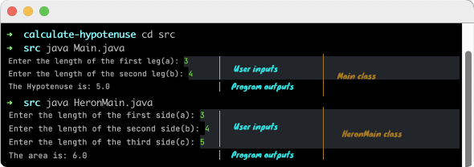

# Calculate Hypotenuse
### In Main class: It calculates the hypotenuse of a right-angled triangle.
### In HeronMain class: it gives the area of a triangle when the lengths of all three sides are known in HeronMain class.
> In geometry, a hypotenuse is the longest side of a right-angled triangle, the side opposite the right angle. The length of the hypotenuse can be found using the Pythagorean theorem, which states that the square of the length of the hypotenuse equals the sum of the squares of the lengths of the other two sides. For example, if one of the other sides has a length of 3 (when squared, 9) and the other has a length of 4 (when squared, 16), then their squares add up to 25. The length of the hypotenuse is the square root of 25, that is, 5.
### On terminal


### Requirements:
* JDK (version 17 is recommended)

### Calculating the hypotenuse


[@See](https://en.wikipedia.org/wiki/Hypotenuse)

### Heron's formula


> In geometry, Heron's formula (sometimes called Hero's formula), named after Hero of Alexandria,[1] gives the area of a triangle when the lengths of all three sides are known. Unlike other triangle area formulae, there is no need to calculate angles or other distances in the triangle first.


[@See](https://en.wikipedia.org/wiki/Heron%27s_formula)
### To run the program of Calculating the hypotenuse:
Open the terminal on the project directory and type:

```
$ cd src
$ java Main.java
```

#### To run the program of Heron's formula:
Open the terminal on the project directory and type:

```
$ java HeronMain.java
```
## Author

👤 **Furkan Denizhan**

- GitHub: [nevisende](https://github.com/nevisende)
- Twitter: [@nevisen_de](https://twitter.com/nevisen_de)
- LinkedIn: [furkan-denizhan](https://www.linkedin.com/in/furkan-denizhan/)

## 🤝 Contributing

Contributions, issues, and feature requests are welcome!

Feel free to check the [issues page](../../issues/).

## Show your support

Give a ⭐️ if you like this project!

## Acknowledgments

- This repo is created for  www.patika.dev and ebebek Java & QA & SAP Spartacus Practicum.
