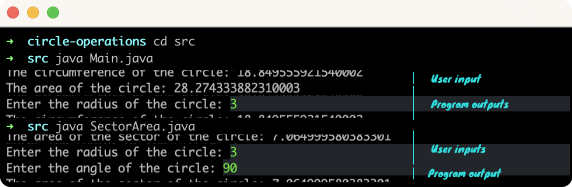

# Circle Operations
## The Main class  calculates the area and circumference of a circle. And SectorArea class calculates the area of a sector of a circle.
### On terminal

### Requirements:
* JDK (version 17 is recommended)

### Details:
Main class:
> It prints the area and the circumference of a circle whose radius you give on the terminal.

SectorArea class:
> It prints the area of a Sector of a Circle whose radius and angle you give on the terminal.
### To run:
Open the terminal on the project directory and type:

```
$ cd src
$ java Main.java
```
To run SectorArea program:

```
$ java SectorArea.java
```
## Author

👤 **Furkan Denizhan**

- GitHub: [nevisende](https://github.com/nevisende)
- Twitter: [@nevisen_de](https://twitter.com/nevisen_de)
- LinkedIn: [furkan-denizhan](https://www.linkedin.com/in/furkan-denizhan/)

## 🤝 Contributing

Contributions, issues, and feature requests are welcome!

Feel free to check the [issues page](../../issues/).

## Show your support

Give a ⭐️ if you like this project!

## Acknowledgments

- This repo is created for  www.patika.dev and ebebek Java & QA & SAP Spartacus Practicum.
