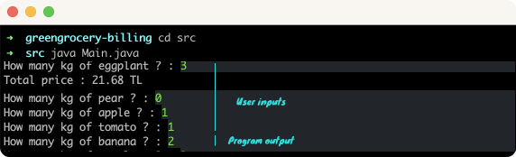

# GREENGROCERY BILLING
## It gives the total price of your fruit basket when you provide the amounts of fruit as kg on the terminal.
### On terminal

### Requirements:
* JDK (version 17 is recommended)

### Details:
Constants:
- Pear: 2.14 TL
- Apple: 3.67 TL
- Tomato: 1.11 TL
- Banana: 0.95 TL
- Eggplant: 5.00 TL

### To run:
Open the terminal on the project directory and type:

```
$ cd src
$ java Main.java
```
## Author

👤 **Furkan Denizhan**

- GitHub: [nevisende](https://github.com/nevisende)
- Twitter: [@nevisen_de](https://twitter.com/nevisen_de)
- LinkedIn: [furkan-denizhan](https://www.linkedin.com/in/furkan-denizhan/)

## 🤝 Contributing

Contributions, issues, and feature requests are welcome!

Feel free to check the [issues page](../../issues/).

## Show your support

Give a ⭐️ if you like this project!

## Acknowledgments

- This repo is created for  www.patika.dev and ebebek Java & QA & SAP Spartacus Practicum.
