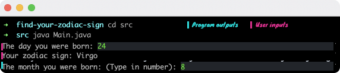

# Find Your Zodiac Sign
## It finds your zodiac sign when you enter your birth month and day.
This software set dates based on that table:

[@Pinterest](https://www.pinterest.ch/pin/432978951687727442/)
### An example


### Requirements:
* JDK (version 17 is recommended)

### To run:
Open the terminal on the project directory and type:

```
$ cd src
$ java Main.java
```
## Author

👤 **Furkan Denizhan**

- GitHub: [nevisende](https://github.com/nevisende)
- Twitter: [@nevisen_de](https://twitter.com/nevisen_de)
- LinkedIn: [furkan-denizhan](https://www.linkedin.com/in/furkan-denizhan/)

## 🤝 Contributing

Contributions, issues, and feature requests are welcome!

Feel free to check the [issues page](../../issues/).

## Show your support

Give a ⭐️ if you like this project!

## Acknowledgments

- This repo is created for  www.patika.dev and ebebek Java & QA & SAP Spartacus Practicum.
