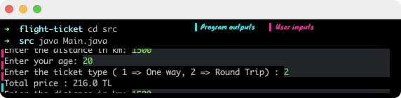

# Flight Ticket
## It prints the flight ticket price on the terminal by calculating your data.
### Details:
- The user must provide valid inputs; otherwise, the program prints "You entered wrong data."
- If the person is under 12, it applies a 50% discount.
- If the person is between 12 and 24, a 10% discount applies.
- If the person is above 65, a 30% discount applies.
- If the person has selected a round trip for the "Journey Type," a 20% discount is applied to the ticket price.

### An example


### Requirements:
* JDK (version 17 is recommended)

### To run:
Open the terminal on the project directory and type:

```
$ cd src
$ java Main.java
```
## Author

👤 **Furkan Denizhan**

- GitHub: [nevisende](https://github.com/nevisende)
- Twitter: [@nevisen_de](https://twitter.com/nevisen_de)
- LinkedIn: [furkan-denizhan](https://www.linkedin.com/in/furkan-denizhan/)

## 🤝 Contributing

Contributions, issues, and feature requests are welcome!

Feel free to check the [issues page](../../issues/).

## Show your support

Give a ⭐️ if you like this project!

## Acknowledgments

- This repo is created for  www.patika.dev and ebebek Java & QA & SAP Spartacus Practicum.
